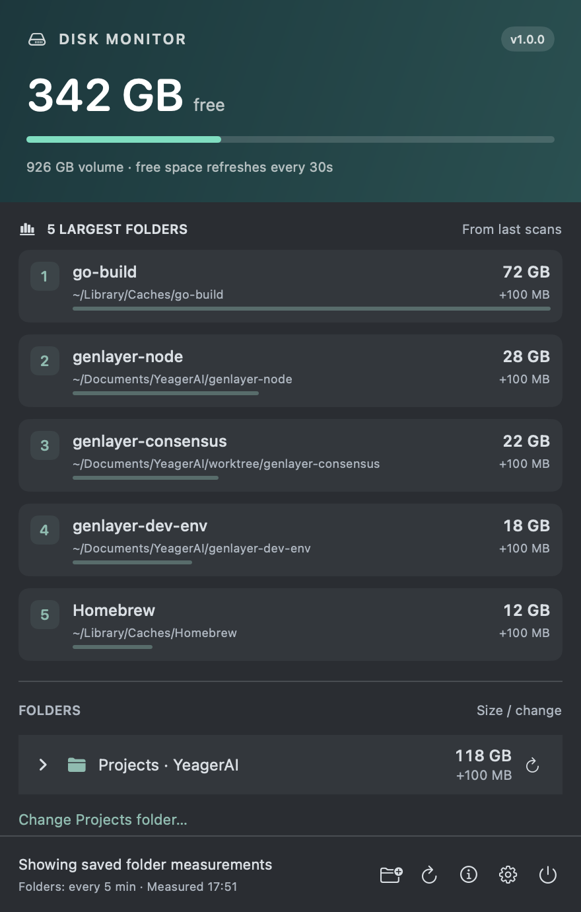
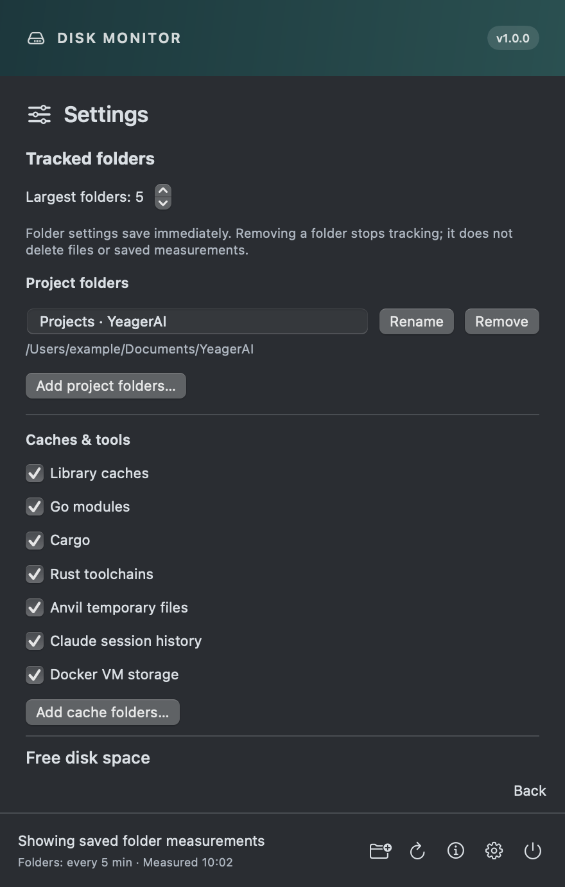

# Disk Monitor

**See where your disk space goes, straight from the macOS menu bar.**

Disk Monitor shows free space, your largest measured folders (five by default), and growth between
scans in a compact native dashboard. Follow projects, worktrees, and shared development
caches without leaving your current app.

<p align="center">
  
</p>

*Current SwiftUI interface rendered with illustrative folder sizes. This is example data, not a live disk reading.*

## Table of contents

- [Overview](#overview)
- [Installation](#installation)
- [Usage](#usage)
- [Alerts](#alerts)
- [Privacy and measurement limits](#privacy-and-measurement-limits)
- [App updates](#app-updates)
- [Documentation](#documentation)
- [Contributing](#contributing)

## Overview

- **Free space at a glance.** A lightweight capacity check runs separately from folder scans.
- **Find growing folders.** The configurable largest-folder list ranks measured projects and caches; expand the tree to investigate.
- **See scan progress.** Active and queued folders have distinct indicators, with previous sizes kept visible.
- **Choose your cadence.** Configure free-space and folder-scan intervals independently.
- **Know when to look.** Menu bar badges distinguish low space, large growth, and incomplete measurements.

Built with SwiftUI and AppKit. **Version 1.0.0** is the first stable version. CI produces drag-to-Applications DMGs
for macOS 15+, with separate Apple Silicon and Intel downloads. Builds are ad-hoc
signed; Apple notarization and launch-at-login are not configured. Signed in-app updates are available from Settings.

## Installation

Download the DMG for your Mac from [Releases](https://github.com/dohernandez/disk-monitor/releases), quit the previous copy, and drag the app into **Applications**. These builds are not Apple-notarized; see the [release and installation guide](docs/RELEASING.md).

### Build from source

You need a Mac with Apple Command Line Tools (Swift) and Python 3 for the build script.
The deployment target is explicitly macOS 15. CI builds and tests Apple Silicon and
Intel separately; older macOS versions are not supported.

```sh
git clone https://github.com/dohernandez/disk-monitor.git
cd disk-monitor
sh build.sh
"build/Disk Monitor.app/Contents/MacOS/DiskMonitor" --self-test
codesign --verify --deep --strict "build/Disk Monitor.app"
open "build/Disk Monitor.app" --args --show
```

The app lives in `build/Disk Monitor.app`. Run each command only after the preceding
one succeeds. When updating a running copy, follow [safe replacement and recovery](docs/DEVELOPMENT.md).

## Usage

Click the drive icon in the menu bar to open the dashboard. Click a top-five entry to
reveal its folder, or expand folder rows to explore children, largest first.

| Control | Action |
|---|---|
| Folder plus | Add another tracked folder |
| Refresh / stop | Scan tracked folders, or stop the current scan |
| Row refresh | Measure that folder and its next two levels |
| Info | Explain how measurements work |
| Settings | Change refresh intervals and read the alert legend |
| Power | Quit Disk Monitor |

Free space defaults to **every 30 seconds**; folder scans default to **every 5 minutes**.
Saved preferences take precedence. Scans run in the background, one at a time; a
busy automatic tick is skipped. Click outside or press Escape to dismiss the popup.

Default cache folders are included only when present on this Mac (or previously
measured): Library caches, Go modules, Cargo, Rust toolchains, Anvil scratch, Claude
history and Docker VM storage. Use **Choose Projects folder** for your project root,
and **Add folder** for others. Right-click any tracked root to **Stop tracking**.
Existing saved Projects measurements remain tracked when upgrading.
See the [usage guide](docs/USAGE.md) for exact paths and scan behavior.

<details>
<summary>View settings and the alert legend</summary>

<p align="center">
  
</p>

*Current interface with default example settings.*

</details>

## Alerts

| Badge | Meaning |
|---|---|
| 🔴 Red ! | Less than **125 GiB** free |
| 🟠 Orange ! | Less than **300 GiB** free, or growth of **10 GiB or more** between comparable scans |
| 🟡 Yellow ? | Incomplete or failed tracked-root measurement, or unavailable free-space reading |
| No badge | No active alert in the available readings |

Red takes priority over orange, then yellow. Click the icon to see the reason.
These are visual menu bar alerts, not macOS notification banners.

## Privacy and measurement limits

Measurements run locally and the app never deletes monitored files. Optional update
checks contact GitHub; no measurements or system profile are sent. There is no telemetry. Its own saved measurements stay in
`~/Library/Application Support/DiskMonitor/`.

Folder sizes can overlap or share APFS storage: **do not add them together or treat
them as guaranteed reclaimable space**. The largest-folder list covers tracked candidates, not
the entire disk. Partial results show **≥**; failed scans preserve earlier complete
readings. Protected folders can remain unreadable. Nix reclaimable space and
Docker-internal accounting are not implemented.

## App updates

Open **Settings → App updates** to check manually or enable daily checks and automatic
installation. Automatic options default off and save immediately. The app verifies
Ed25519 signatures on the feed and download before extraction; a checksum alone is
not accepted. Version 1.0.0 needs one manual upgrade to gain this feature. See the
[update and key-management guide](docs/RELEASING.md#signed-in-app-updates).

Cache directories are restricted to the owner (0700), with private cache files at
0600. Existing cache permissions are tightened without resetting saved data.

## Documentation

| Guide | Contents |
|---|---|
| [Usage and measurements](docs/USAGE.md) | Tracked paths, refresh behavior, sizes and partial readings |
| [Architecture](docs/ARCHITECTURE.md) | Source map, lifecycle, scanner, persistence and known gaps |
| [Development and recovery](docs/DEVELOPMENT.md) | Build, tests, safe replacement, backups and missing-icon diagnosis |
| [Acceptance checks](docs/ACCEPTANCE.md) | Behavior and UI checks to preserve |
| [Agent instructions](AGENTS.md) | Rules for agents maintaining the project |
| [Releases and branch rules](docs/RELEASING.md) | Automated versions, installer verification, signing and main protection |
| [Screenshot sources](docs/screenshots/README.md) | Reproduce these previews without reading live measurements |

## Contributing

Read the architecture and maintenance rules before changing behavior. Keep changes
focused, preserve saved settings and measurements, and run the checks relevant to
your change. Use temporary folders for scanner tests. Include the validation results
and updated screenshots for visible UI changes in your pull request.

Companion app: [Token Monitor](https://github.com/dohernandez/token-monitor).

Permission-only scans: confirmed `du` permission denials show “Protected by macOS”
(or “Partial · protected contents” when a lower-bound size is available). They do
not trigger the menu-bar ? badge. Mixed, unknown and other scan failures still warn;
free-space and growth thresholds are unchanged. Classification uses all diagnostics
before display truncation. Legacy partial readings require a fresh scan before
suppressing their warning. No filesystem permissions are changed.

## Folder settings

Settings → Tracked folders configures the largest-folder count (1–50, default 5),
multiple project roots with editable labels, detected default-cache toggles and
custom cache roots. These controls save immediately, separately from refresh
interval edits. Project labels save with Rename or Return. Remove stops tracking
without deleting measurements or files. The top list ranks measured children across
all project roots, worktree children, Library cache children and configured cache/extra
roots, suppressing overlapping parent/child entries as before.

Optional saved fields projects, customCaches and largestCount preserve old JSON
compatibility. With projects absent, the old projectPath or legacy saved YeagerAI
root remains active; an explicitly empty projects array means no project roots.
Existing readings, extras, exclusions and intervals are preserved. Older app versions
ignore the new fields and cannot reproduce multiple-root/count settings on rollback.
Fixture checks cover migration, multiple roots, label/count persistence, boundaries,
custom caches, duplicate prevention and ranking across roots. Native folder-picker
and Rename/Remove click behavior still require manual acceptance.
